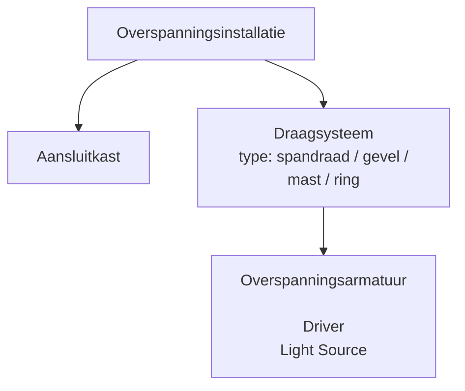
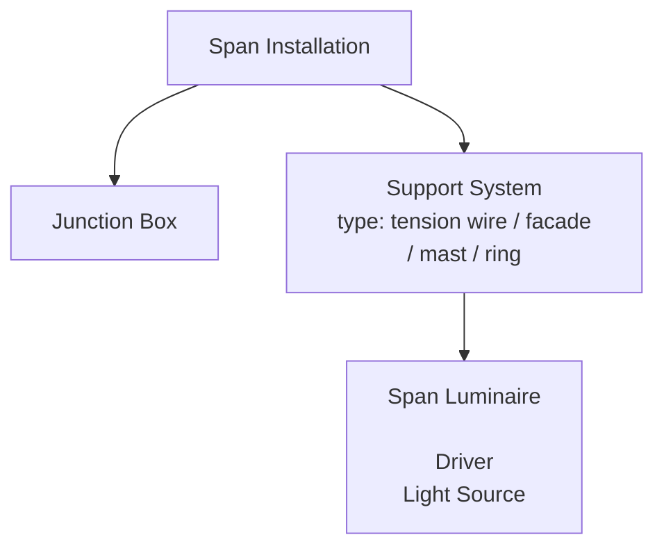

## Decomposition structure

The Dutch version:

The English version:

At the top level we have the "Span Installation" entity. In AIP this is represented as an object of a specific type
(`Overspanningsinstallatie`).

Attached to an object of this type, a decomposition of 2 levels can be created with at the top level 2 entity
types: "Junction Box" and "Support System".

One "Span Installation" can have multiple "Junction Boxes" and "Support Systems".

A "Support System" can be one of 4 types:

1. tension wire
2. facade
3. mast
4. ring

A "Support System" can consist of multiple "Span Luminaire" elements which can be added at the 2nd level below it.

A "Span Luminaire" element always contains a "Driver" and a "Light Source".
